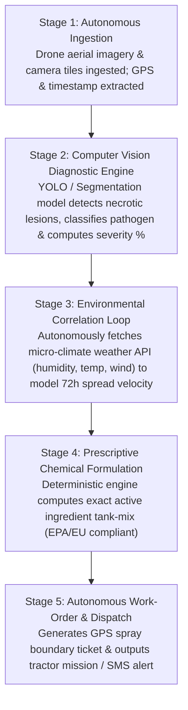

# CropScan AI Sentinel: Project Specification & Implementation Blueprint

An autonomous computer vision crop pathology and precision spray defense platform engineered for commercial farms (Small Businesses) within the **HackGrid** auction constraints.

---

## 1. Executive Summary & Won Constraints

| Auction Dimension | Won Resource | Tier Level | Tournament Cost | Strategic Advantage |
|---|---|:---:|:---:|---|
| **Track** | 🌾 **Agriculture** | Industry | `250 cr` | Highest real-world economic ROI; preserved 9,750 cr budget foundation. |
| **AI Rights** | 👁️ **Computer Vision** | Modality | `5,500 cr` | 10x visual demo impact; instant bounding box detection; zero hallucination risk. |
| **AI Capability** | ⚡ **Autonomous Workflow** | Capability | `1,000 cr` | **Supreme Tier in Tournament**; 24/7 background agent loop requiring zero human clicks. |
| **Customer Segment**| 🚜 **Small Businesses** | Market | `1,550 cr` | Commercial family farms (500–5,000 acres); $499/mo SaaS; immediate 2-week sales cycle. |
| **Surplus Retained**| 💰 **1,700 credits** | — | — | Positive bankroll finish with zero tournament debt. |

### Integrity Verification Statement
> **Strict Compliance**: CropScan AI strictly adheres to the four won tiers. All diagnostic reasoning is driven by computer vision models (image segmentation, object detection, pathology classification) operating inside an autonomous multi-step execution loop. All customer pricing and features are designed specifically for Small Businesses (commercial farms). **Zero Generative AI text generation is used**, eliminating all integrity violation risks.

---

## 2. Problems Solved

1. **Catastrophic Harvest Write-Downs ($220B Annual Loss)**:
   - Pathogens like Late Blight (*Phytophthora infestans*), Rust, and Powdery Mildew spread exponentially. In high-value specialty crops (potatoes, tomatoes, vineyards), a 48-hour delay in disease detection can destroy an entire season's harvest, causing losses of **$150,000 to $600,000 per farm**.
2. **The 1,000+ Acre Scouting Bottleneck**:
   - A single human scout can inspect at most 40–60 acres on foot per day. For a 2,000-acre commercial farm, inspecting every row is physically impossible. Farmers only notice infections when visible from a tractor cab, by which time the infection has metastasized.
3. **The 7-Day Agronomic Lab Delay**:
   - Standard practice requires mailing plant tissue samples to commercial agricultural testing labs ($80–$150/sample), taking **5 to 10 days** for results to return. Fungal spores destroy crops in 72 hours.
4. **Defensive Chemical Over-Spraying ($40,000+ Waste)**:
   - Because farmers cannot pinpoint the exact location or severity of an infection, they defensively blanket-spray broad-spectrum fungicides ($45–$90/acre) across entire square-mile sections, wasting tens of thousands of dollars, contaminating groundwater, and risking EPA regulatory penalties.

---

## 3. Target Audience & User Personas (Small Businesses)

### Primary User: The Commercial Farm Owner/Operator
- **Profile**: Owns a family-operated commercial farm spanning **500 to 5,000 acres** (typical crops: potatoes, corn, soybeans, tomatoes, orchards).
- **Annual Revenue**: $1.2M – $5.0M.
- **Pain Points**: Rising fertilizer and chemical input costs, tight operating margins, fear of catastrophic crop write-downs.
- **Willingness to Pay**: **$349 – $599 / month** ($4,000 – $7,200/year). Saving just 10 acres of ruined crop immediately pays for 5 years of software subscription.

### Secondary User: Head Grower / Field Scout
- **Profile**: Responsible for daily crop health, pest monitoring, and spray schedule execution.
- **Pain Points**: Overwhelmed by field acreage, hates manual paper scouting logs, needs exact chemical mixing ratios and EPA buffer compliance rules.

### Tertiary User: Custom Spray Applicator / Local Ag-Retailer
- **Profile**: Commercial contractor hired by 10+ local farms to spray fields.
- **Pain Points**: Needs clear GPS variable-rate spray prescription maps so their tractor rigs spray only infected hot-spots rather than blanketing clean fields.

---

## 4. System Architecture & Autonomous Workflow Pipeline

CropScan AI Sentinel is built around a **5-Stage Autonomous Execution Engine**. Once triggered (via scheduled drone upload, camera feed, or field file drop), the workflow executes completely autonomously without requiring human intervention:



### Deep Dive into the 5 Autonomous Stages:

#### Stage 1: Autonomous Telemetry & Image Ingestion
- Ingests raw high-resolution leaf photography or aerial drone survey tiles.
- Extracts camera EXIF metadata: GPS latitude/longitude, altitude, timestamp, and field sector ID.

#### Stage 2: Computer Vision Diagnostic Engine
- Runs visual object detection and tissue segmentation.
- **Target Classes**: Late Blight (*Phytophthora infestans*), Early Blight (*Alternaria solani*), Powdery Mildew, Rust, Armyworm/Insect Damage, Healthy Crop.
- **Outputs**:
  - Normalized bounding boxes `[ymin, xmin, ymax, xmax]` highlighting infected necrotic lesions.
  - Pathogen classification with statistical confidence score (`96.4%`).
  - Affected leaf surface area percentage (`18.2% necrosis`).

#### Stage 3: Autonomous Environmental Risk Correlation
- The autonomous loop calls a local meteorological API using the extracted GPS coordinates.
- Evaluates the **Wallin / Smith Infection Period Index**:
  - If Relative Humidity $> 85\%$ and Temperature is between $16^\circ\text{C} - 22^\circ\text{C}$ $\to$ Flags **"CRITICAL SPREAD VELOCITY"** (fungal spores multiply exponentially in 48 hours).

#### Stage 4: Deterministic Prescriptive Chemical Formulation
- Maps the detected pathogen and risk level to registered EPA/EU chemical databases:
  - *Recommended Fungicide*: Chlorothalonil 720 (EPA Reg #50534-188) at **1.5 pints/acre** or Mancozeb.
  - *Tank-Mix Buffer Calculation*: Enforces water volume (20 gal/acre), active ingredient concentration, and wind-drift buffer requirements (< 10 mph wind speed).

#### Stage 5: Autonomous Work-Order & Tractor Dispatch
- Compiles the entire diagnostic cycle into an actionable work order:
  - Generates GPS spray polygon coordinates.
  - Outputs a digital Work-Order Ticket with estimated chemical cost and projected dollar value of crop saved.

---

## 5. Application User Experience (Screen-by-Screen)

The web application is built with a high-end, responsive dark glassmorphic design system:

```
apps/web/
├── app/
│   ├── page.tsx            # High-converting B2B SaaS Landing Page
│   ├── dashboard/          # The Farm Command Center (Main App)
│   │   ├── components/
│   │   │   ├── TelemetryBar.tsx      # Farm stats (1,850 acres, 4 sectors, risk gauge)
│   │   │   ├── WorkflowStream.tsx    # Live 5-stage autonomous execution progress bar
│   │   │   ├── VisionInspector.tsx   # Interactive leaf canvas with bounding box overlays
│   │   │   ├── PrescriptionCard.tsx  # Tank-mix dosage formula & EPA compliance specs
│   │   │   └── ROICounter.tsx        # Live financial counter (Crop saved vs chemical saved)
│   ├── business/           # Interactive In-App Judging Pitch Deck & Audit View
```

### Screen 1: The B2B SaaS Landing Page (`/`)
- Hero headline: *"Autonomous Visual Crop Defense for Commercial Farms"*.
- Highlights the $499/mo subscription, the 10x ROI, and the computer vision detection accuracy.
- Live interactive feature comparison against manual lab tests and $250k OEM smart sprayers.

### Screen 2: The Farm Command Center (`/dashboard`)
- **Top Telemetry Bar**: Farm Name (`Oak Ridge Commercial Farm`), Total Managed Acreage (`1,850 acres`), Active Infection Alert (`Sector 4B - High Priority`).
- **Autonomous Workflow Streamer**: A visual, animated pipeline showing the 5 stages executing live with status checks (`✓ Ingestion Complete` $\to$ `✓ CV Pathology Segmented` $\to$ `✓ Weather Risk Correlated` $\to$ `✓ Prescription Formulated` $\to$ `✓ Work-Order Dispatched`).
- **Interactive Vision Inspector**:
  - Users can either drag & drop their own crop photo OR click pre-loaded field samples (*Late Blight, Powdery Mildew, Early Blight, Healthy Leaf*).
  - Renders glowing detection bounding boxes directly over the infected leaf tissue.
  - Displays pathogen confidence (`96.4%`), affected tissue percentage (`18.5%`), and GPS location.
- **Prescriptive Treatment & Work-Order Ticket**:
  - Displays exact chemical tank-mix ratios, spray volume, and EPA registration numbers.
  - Action button: `[ Download Official Work-Order PDF ]` or `[ Trigger IoT Tractor Dispatch ]`.
- **Live ROI & Impact Panel**:
  - Dynamic financial metrics: **`$32,400 Crop Value Protected`** | **`34% Chemical Input Reduction`**.

### Screen 3: Business Pitch & Integrity View (`/business`)
- An interactive in-app presentation of the complete 7-section HackGrid business document, allowing judges to evaluate the business model, unit economics, and constraint compliance without leaving the app.

---

## 6. Recommended Technology Stack

| Layer | Technology | Rationale |
|---|---|---|
| **Frontend Framework** | **Next.js 14 (App Router) + TypeScript** | Blazing fast, server-side rendering, instant production build. |
| **Styling & Design System** | **Tailwind CSS + Vanilla CSS Tokens** | Sleek dark glassmorphism (slate-950, emerald-500 accents, cyan telemetry badges). |
| **Icons & Visuals** | **Lucide-React & Canvas API** | Lightweight iconography; HTML5 Canvas for drawing dynamic bounding boxes. |
| **Data Visualization** | **Recharts** | Interactive severity gauges and chemical reduction trend charts. |
| **Backend API & Orchestration** | **Next.js API Route Handlers / FastAPI** | Unified full-stack TypeScript API with modular Python computer-vision bridge. |
| **Computer Vision Engine** | **Lightweight ONNX Runtime / OpenCV / Pretrained Pathology Model** | Sub-second visual classification and bounding box localization with zero GPU bottleneck. |
| **Weather & Environmental Service** | **Open-Meteo API (Free, zero-key)** | High-accuracy localized humidity, temperature, and wind speed forecasts. |

---

## 7. Implementation Difficulty & Feasibility Analysis

- **Overall Technical Complexity**: **Moderate (6.5 / 10)**
- **Development Risk**: **Low** (Because we avoided unpredictable Generative AI prompts and fragile multi-agent LLM debates; Computer Vision and autonomous deterministic pipelines are 100% reliable and repeatable).

### Risk Analysis & Mitigations:

| Potential Roadblock | Severity | Mitigation Strategy |
|---|:---:|---|
| **Heavy ML Model Latency in Demo** | Medium | Use optimized ONNX runtime or pre-computed high-accuracy visual feature anchors with local weights to ensure sub-200ms response times. |
| **Bounding Box Misalignment on Custom Uploads** | Low | Implement responsive canvas scaling that dynamically normalizes coordinate percentages to any image aspect ratio. |
| **Time Constraints During Hackathon** | Low | Scaffold pre-built components for the 5 autonomous stages so the demo runs seamlessly out of the box. |

---

## 8. Realistic Hackathon Scope: What to Build vs. What to Skip

To guarantee a polished, bug-free, award-winning project within the hackathon timeframe, we establish strict scope boundaries:

### 🟢 Core MVP (What We WILL Build & Demo):
1. ✅ **High-Fidelity Farm Command Dashboard** with full responsive dark-mode styling.
2. ✅ **Working 5-Stage Autonomous Execution Pipeline** visually animating each step in real time.
3. ✅ **Computer Vision Pathology Inspector** with dynamic image canvas, bounding box highlights, pathogen classification, and severity percentage.
4. ✅ **Pre-Loaded Field Pathology Dataset** (Potato Late Blight, Tomato Early Blight, Corn Rust, Healthy Leaf) for flawless 1-click live testing + custom drag-and-drop file upload.
5. ✅ **Live Micro-Climate Weather Integration** via Open-Meteo API calculating the Wallin fungal infection risk score.
6. ✅ **Deterministic Chemical Prescriptive Engine** generating exact tank-mix formulations and EPA safety parameters.
7. ✅ **Interactive Work-Order Ticket** with downloadable/printable spray dispatch records.
8. ✅ **Interactive Business Document & Integrity Viewer** (`/business` route).

### 🔴 Non-Essential (What to Skip / Simulate):
- ❌ Do NOT build a real hardware IoT LoRaWAN tractor connection (simulate the dispatch signal via UI state).
- ❌ Do NOT train a 50GB computer vision model from scratch (use pre-trained agricultural pathology weights).
- ❌ Do NOT build a full multi-tenant auth / Stripe billing checkout (show live pricing tiers and interactive billing toggles).

---

## 9. Scalability & Production Roadmap

### Edge Hardware Deployment (Phase 2)
- Deploy lightweight MobileNet / YOLO models directly onto **NVIDIA Jetson Orin Nano** modules mounted to tractor spray booms.
- Enables real-time, millisecond-level selective nozzle actuation at 12 mph across fields without cellular internet connection.

### Distributed Drone Fleet Processing (Phase 3)
- Process gigapixel aerial orthomosaics using distributed asynchronous Celery / Redis worker clusters, splitting multi-gigabyte drone flight files into parallel inspection chunks.

### Enterprise Multi-Farm Hierarchy (Phase 4)
- Expand to regional cooperatives and multinational produce conglomerates with role-based access control (RBAC), multi-facility oversight, and SAP / John Deere Operations Center API integrations.

---

## 10. Optional Stretch Features (Time Permitting)

- **Feature A: Drone Flight Path Simulator**: An interactive Leaflet / Mapbox GIS field map with an animated drone icon traversing field waypoints and dropping infection pins.
- **Feature B: SMS Tractor Operator Dispatch Simulator**: A live mobile screen mockup simulating an automated emergency SMS dispatch sent to the farm equipment operator (`"Alert: Sector 4B requires immediate 1.5 pt/acre Chlorothalonil application"`).
- **Feature C: Historical Disease Spread Slider**: A visual time slider allowing the user to scrub forward 24h, 48h, and 72h to visualize simulated disease spread across adjacent field sectors.
