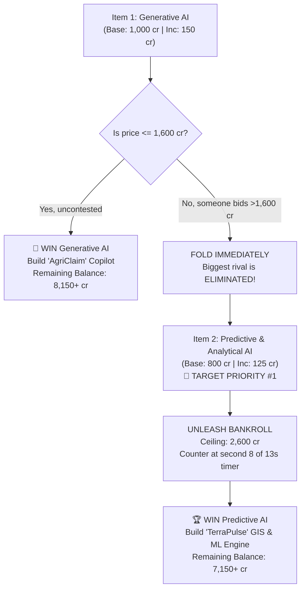

# HackGrid: Round 2 (AI Rights) Master Bidding Plan

**Current Status**: 
- **Won Track**: `Agriculture` (Paid: 250 cr)
- **Current Total Balance**: `9,750 cr`
- **Round 2 Reserve Locked**: `2,000 cr`
- **Available for Bidding in Round 2**: **`7,750 cr`** *(Top 5% bankroll hackathon-wide)*
- **Pod Sizing**: Reshuffled into **4-team pods** (4 resources for 4 teams). Every item won eliminates 25% of your competition!

---

## 🎯 Executive Game Plan: The Two-Step Strike

---

## 1. Item-by-Item Bidding Script & Ceilings

### 1️⃣ Resource 1: Generative AI (The "Cheap Steal" Tactic)
- **Starting Bid**: `1,000 cr` | **Min Increment**: `150 cr`
- **Role in Strategy**: Test the room. If cheap, take it. If contested, use it to eliminate a rival.
- **Your Walk-Away Ceiling**: **`1,600 cr`**

#### Execution Protocol:
1. When it opens, place the base bid: **`1,000 cr`** (or counter their 1,000 with **`1,150 cr`**).
2. If an opponent bids `1,300 cr`, counter to **`1,450 cr`** at second 8 of the countdown.
3. If an opponent bids **`1,600 cr` or higher**: **FOLD IMMEDIATELY. DO NOT BID AGAIN.**
4. **Why folding here is a massive win**:
   - The winning team is now **permanently eliminated** from Round 2.
   - They just blew 1,600–2,500+ credits.
   - Predictive AI is now wide open for you, with one less competitor!

---

### 2️⃣ Resource 2: Predictive & Analytical AI (🎯 YOUR TRUE TARGET)
- **Starting Bid**: `800 cr` | **Min Increment**: `125 cr`
- **Role in Strategy**: **OUR ABSOLUTE BEST MATCH FOR AGRICULTURE.**
- **Your Walk-Away Ceiling**: **`2,600 cr`** *(Aggressive Domination)*

#### Execution Protocol:
1. The moment it opens, place the base bid: **`800 cr`**.
2. If anyone counters to `925 cr`, wait until second **8 or 9** of the 13-second timer, then hit **`1,050 cr`**.
3. If they counter to `1,175 cr`, hit **`1,300 cr`**.
4. Push authoritatively with your 7,750 cr available bankroll up to **`2,600 cr`**.
5. **Why you will win**: With the GenAI winner eliminated and other teams holding depleted budgets from Round 1, no sane team will fight you past 1,800–2,200 cr.

---

### 3️⃣ Resource 3: Computer Vision (Safety Net)
- **Starting Bid**: `600 cr` | **Min Increment**: `100 cr`
- **Role in Strategy**: 99.9% you won't need this, but if someone bid crazy on Predictive, this is a top-tier fallback.
- **Your Walk-Away Ceiling**: **`1,800 cr`**
- **SaaS Concept**: Visual leaf pathology and weed detection with bounding boxes (like John Deere / Blue River Tech).

---

### 4️⃣ Resource 4: Speech & Audio AI (Absolute Floor)
- **Starting Bid**: `400 cr` | **Min Increment**: `—`
- **Role in Strategy**: Floor fallback.
- **Your Walk-Away Ceiling**: **`600 cr`**

---

## 2. Quick Reference Bidding Card

| Order | Resource | Base Bid | Increment | Priority | Max Ceiling | Action Rule |
|:---:|---|:---:|:---:|:---:|:---:|---|
| **1st** | **Generative AI** | `1,000 cr` | `150 cr` | Opportunistic | **`1,600 cr`** | Bid lightly. If pushed >1,600 cr, fold and let rival eliminate themselves. |
| **2nd** | **Predictive AI** | `800 cr` | `125 cr` | **🎯 TARGET #1** | **`2,600 cr`** | **UNLEASH PURSE.** Counter ruthlessly at sec 8. Claim your prize. |
| **3rd** | **Computer Vision**| `600 cr` | `100 cr` | Safety Net | **`1,800 cr`** | High-value visual crop disease detection if Predictive is lost. |
| **4th** | **Speech & Audio** | `400 cr` | `—` | Floor | **`600 cr`** | Do not overpay. Take at floor if it falls to you. |

---

## 3. Product Blueprints for Your Won Resource

### If You Win Predictive & Analytical AI: **"TerraPulse"**
- **Core Pitch**: Precision Crop Yield & Soil Deterioration Early Warning System.
- **No-GenAI Display Stack**:
  - Interactive GIS parcel grid (satellite NDVI heatmap overlays).
  - Time-series yield projection with 95% confidence uncertainty cones.
  - Explainable AI (SHAP waterfall chart: `+12% rainfall`, `-28% soil salinity`).
  - Interactive "What-If" irrigation/fertilizer sliders with instant gross revenue recalculation.
- **Judging Edge**: 100% compliant with zero hallucination risk; feels like an enterprise agronomist terminal.

### If You Win Generative AI: **"AgriClaim & GrantOS"**
- **Core Pitch**: Autonomous Agricultural Subsidy & Crop Insurance Claim Engine.
- **GenAI Capabilities**:
  - Ingests weather disaster telemetry and farm acreage.
  - Autonomously generates multi-page official USDA/EU grant applications with federal legal code citations.
- **Judging Edge**: Clear financial ROI (recovering $50,000+ in unclaimed disaster aid for farms).
