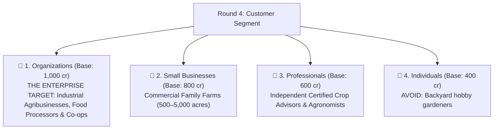

# HackGrid: Round 4 (Customer Segment) Final Master Plan

**Current Status**:
- **Won Track**: `Agriculture` (250 cr)
- **Won AI Rights**: `Computer Vision` (5,500 cr)
- **Won AI Capability**: `Autonomous Workflow (full agent systems)` (1,000 cr) — 🏆 **SUPREME TIER**
- **Total Remaining Balance**: **`3,250 cr`**
- **Reserve Locked in Round 4**: **`0 cr`**
- **Available for Bidding in Round 4**: **`3,250 cr`** *(You can spend ALL of it!)*

---

## 🎯 Strategic Objective: Capture Enterprise Organizations (#1 PRIORITY)

You won the highest capability tier in the hackathon (**Autonomous Workflow**). An autonomous 24/7 background drone and vision pipeline is naturally built for **Enterprise Agricultural Organizations** ($75k–$250k ACV)!

---

## 1. Item-by-Item Bidding Script & Ceilings (Assuming Standard Order)

### 1️⃣ Organizations (Base: 1,000 cr | Inc: 150 cr) — 🏆 OUR #1 TARGET
- **Who they are**: Enterprise Agribusinesses (Dole, Driscoll's, Cargill, Del Monte), Food Processors (McCain, Lamb Weston), and Regional Farm Cooperatives.
- **Why this is the Absolute Best Fit for Autonomous Workflow**:
  - Industrial conglomerates managing 50,000–500,000 acres across dozens of regional facilities.
  - They demand autonomous 24/7 drone fleet monitoring without human clicks.
  - **Unbeatable Enterprise SaaS ACV**: **$75,000 to $250,000/year** contracts.
- **Your Walk-Away Ceiling**: **`3,000 cr`** *(Aggressive Domination — Unleash your purse!)*
- **Bidding Ladder**: `1,000 cr` $\to$ `1,150 cr` $\to$ `1,450 cr` $\to$ `1,750 cr` $\to$ `2,050 cr` $\to$ `2,350 cr` $\to$ `2,650 cr` $\to$ **`2,950 cr`**.

---

### 2️⃣ Small Businesses (Base: 800 cr | Inc: 125 cr) — 🛡️ PREMIUM FALLBACK
- **Who they are**: Commercial Family Farms (500 to 5,000 acres).
- **Your Walk-Away Ceiling**: **`2,600 cr`**
- **Why it works**: If an opponent spends all their credits pushing Organizations past 3,000 cr, step in here and lock down Small Businesses easily!

---

### 3️⃣ Professionals (Base: 600 cr | Inc: 100 cr) — 🥉 SOLID THIRD
- **Who they are**: Independent Agronomists & Certified Crop Advisors (CCAs).
- **Your Walk-Away Ceiling**: **`2,000 cr`**

---

### 4️⃣ Individuals (Base: 400 cr | Inc: —) — 🚫 AVOID
- Backyard hobby gardeners. Do not let yourself fall here!

---

## 2. Quick Bidding Summary for Round 4

| Order | Resource | Base | Priority | Max Ceiling | Strategy |
|:---:|---|:---:|:---:|:---:|---|
| **1st** | **Organizations** | `1,000 cr` | **🏆 TARGET #1** | **`3,000 cr`** | **UNLEASH PURSE.** Strike immediately and claim the enterprise tier! |
| **2nd** | **Small Businesses** | `800 cr` | Premium Fallback | **`2,600 cr`** | High-value commercial farm fallback. |
| **3rd** | **Professionals** | `600 cr` | Solid Third | **`2,000 cr`** | Consulting seat-based SaaS power tool. |
| **4th** | **Individuals** | `400 cr` | Floor | — | Avoid. |
